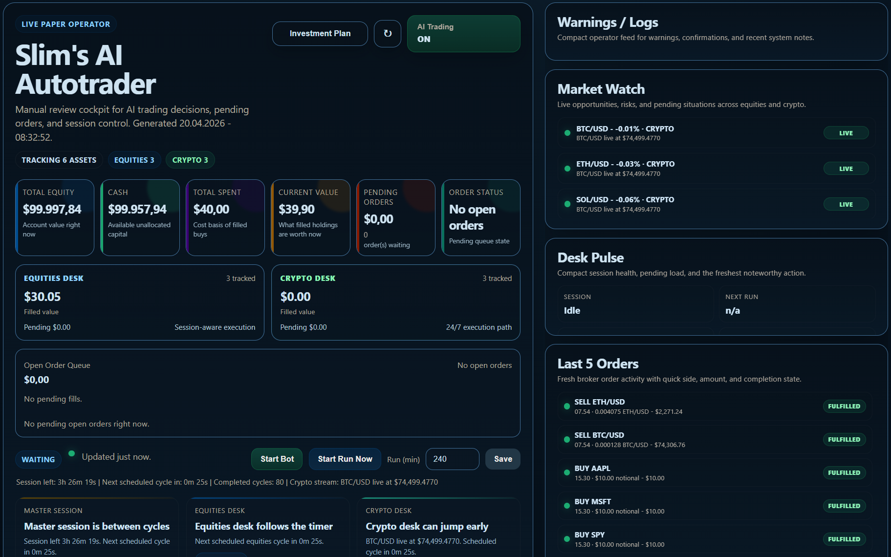
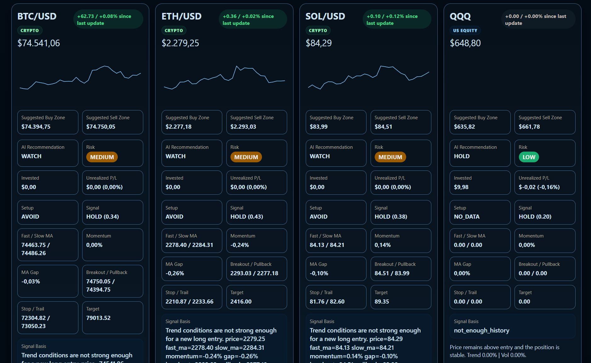
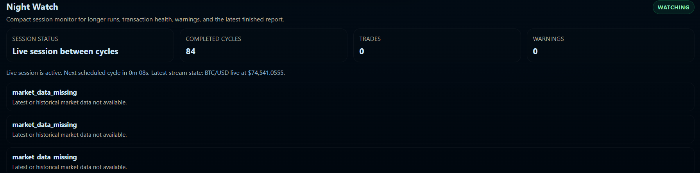

# SLIM's AI Autotrader

AI-assisted paper trading lab for equities and crypto, built around `Alpaca Paper`, a live operator dashboard, explainable strategy output, and a GitHub automation path for CI and Pages publishing.

The platform is already live in `Alpaca Paper` mode and actively supports both:

- equity paper trading
- crypto paper trading

That means the current system is not just documentation and mockups anymore. It already runs real automated sessions against the broker's paper environment, updates the operator dashboard in real time, and records order activity across stocks, ETFs, and crypto pairs.

## Overview

SLIM's AI Autotrader is a research-first automated trading project that combines:

- paper trading safety first
- mixed equities + crypto monitoring
- operator-controlled session management
- explainable trade signals and risk checks
- live dashboard reporting
- GitHub automation for CI and public documentation

This is not pitched as a magical profit printer. It is an auditable trading lab designed to make decisions visible, testable, and reviewable before anything approaches real money.

## Screenshots

### Main Operator Window



This is the main control surface for the live paper-trading session. It shows top-level capital state, active market watch signals, pending orders, operator controls, and the latest order activity while the bot is running.

### Market Overview Cards



These cards are the per-asset decision layer. Each one shows live price context, suggested buy/sell zones, recommendation state, risk level, momentum, moving-average structure, and the strategy basis used for the current asset.

### Night Watch Monitor



The Night Watch view is built for longer unattended runs. It summarizes session health, completed cycles, warnings, and the latest notable events so the operator can review what happened during a multi-hour automated session.

## What The Project Currently Does

- connects to Alpaca paper trading
- supports `dry_run`, `paper`, `crypto`, and `mixed` runtime profiles
- tracks equities and crypto in one operator experience
- renders a live operator dashboard with:
  - account summary
  - market watch
  - desk pulse
  - recent order tape
  - warnings / logs
- supports manual operator actions like:
  - buy next run
  - start bot
  - start run now
  - AI trading on/off
- enforces budget and allocation rules through an investment plan
- generates session reports and runtime artifacts
- includes CI and GitHub Pages workflows for publishing the project cleanly

## Live Paper Trading Status

The platform is currently operating as a live `paper trading` system, which means:

- it connects to Alpaca's paper broker endpoints
- it can run active trading sessions against equities and crypto
- it places paper orders and tracks their outcomes
- it updates the operator dashboard and reports while the session is running

Important distinction:

- `live paper trading` means the automation and broker flow are real
- it does **not** mean live real-money trading

That distinction matters, because the current goal is controlled experimentation, auditability, and strategy validation before anything gets close to a real-money deployment.

## Core Product Shape

The current product is built around three layers:

1. `Trading engine`
   - strategy generation
   - risk approval
   - broker adapters
   - runtime/session coordination

2. `Operator layer`
   - local web GUI
   - manual overrides
   - run controls
   - monitoring panels

3. `Documentation + automation`
   - architecture docs
   - runbooks
   - GitHub Actions CI
   - GitHub Pages site generation

## Current Feature Highlights

### Trading

- Alpaca paper broker integration
- null broker for safer early tests
- mixed market watchlists
- crypto live stream wakeups
- one-shot manual buy/sell overrides
- session-length based runs

### Risk And Controls

- explicit runtime modes
- investment plan with cash / equity / crypto planning buckets
- duplicate-order suppression
- reconciliation on startup
- operator kill switch
- explainable block reasons in logs and reports

### Operator Dashboard

- top-level account and exposure cards
- equities desk and crypto desk summaries
- pending order overview
- market watch rail
- compact warning/log feed
- recent order tape
- night watch monitoring section

### Reporting

- JSON dashboard snapshots
- HTML operator dashboard
- runtime state tracking
- end-of-session summary artifacts

## Repository Layout

- `src/` application code
- `tests/` automated test coverage
- `config/` runtime, watchlist, risk, and strategy examples
- `docs/research/` planning and reference material
- `docs/architecture/` system and operator design
- `docs/operations/` runbook and controls
- `docs/setup/` onboarding and GitHub setup guides
- `scripts/` helper tooling, including GitHub Pages generation
- `docs/assets/readme/` README and documentation visuals

## Quick Start

### 1. Create a virtual environment

```powershell
python -m venv .venv
.\.venv\Scripts\Activate.ps1
```

### 2. Install the project

```powershell
pip install -e .
pip install pytest
```

### 3. Configure environment

Copy `.env.example` and fill in your Alpaca paper credentials.

Important notes:

- `paper` mode requires valid Alpaca paper credentials
- `dry_run` can use the null broker
- crypto and mixed profiles are available through the example config files

### 4. Run tests

```powershell
pytest
```

### 5. Start the app

```powershell
.\.venv\Scripts\python -m autotrade.main
```

## Configuration Pointers

Useful files to start with:

- `config/runtime.paper.example.json`
- `config/runtime.crypto.example.json`
- `config/runtime.mixed.example.json`
- `config/watchlist.paper.example.json`
- `config/watchlist.crypto.example.json`
- `config/watchlist.mixed.example.json`
- `config/investment-plan.paper.example.json`
- `config/risk.paper.example.json`
- `config/strategy.paper.example.json`

## Recommended Reading Order

1. `docs/research/alpaca-paper-build-plan.md`
2. `docs/research/published-resources.md`
3. `docs/research/strategy-categories.md`
4. `docs/setup/mcp-onboarding.md`
5. `docs/architecture/system-design.md`
6. `docs/architecture/operator-dashboard-and-automation.md`
7. `docs/operations/security-controls.md`
8. `docs/operations/runbook.md`
9. `docs/setup/github-automation-and-pages.md`

## GitHub Automation

The repository includes a small but useful GitHub automation path:

- `.github/workflows/ci.yml`
  runs `pytest` on pushes and pull requests
- `.github/workflows/pages.yml`
  builds and deploys the static project site
- `scripts/build_github_pages.py`
  generates the Pages output into `site/`

Local Pages preview:

```powershell
.\.venv\Scripts\python.exe scripts\build_github_pages.py --output site --repo Shadow2442/SLIM-s-AI-Autotrader
```

## Current Status

The project is in an active experimental phase.

What is already real:

- operator web GUI
- paper trading flow
- session orchestration
- mixed crypto/equity support
- investment-plan controls
- reporting artifacts
- GitHub repo automation

What is still evolving:

- strategy sophistication
- news/event ingestion
- long-run autonomous reliability
- portfolio analytics depth
- cleaner production-grade deployment flow

## Suggested Next Steps

The best next upgrades are:

1. tighten the README, repo description, and GitHub topics for discovery
2. enable GitHub Pages in repo settings
3. verify the first Pages deployment
4. add issue templates and a pull request template
5. improve strategy quality and portfolio analytics
6. continue polishing the operator dashboard for long unattended runs

## Safety Note

This project is currently built for controlled testing and paper trading. Nothing here should be treated as financial advice, production trading guidance, or a promise that the robot has suddenly become Warren Buffett with a websocket.

## License

This repository currently includes the Unlicense text from the existing GitHub repo root.
