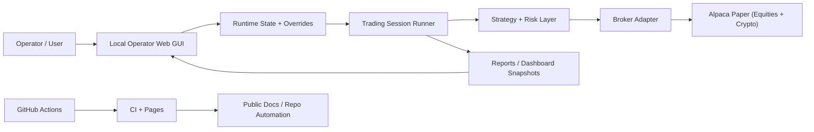

# System Overview

## Purpose

This document gives a fast architectural snapshot of **SLIM's AI Autotrader** so new operators and contributors can understand how the moving parts fit together without reading the entire codebase first.

## High-Level Flow

## Main Layers

### Operator Layer

The operator layer is the local control surface. It exposes:

- session start/stop controls
- AI trading enable/disable
- manual buy/sell requests
- market watch
- warnings, order tape, and reporting

### Runtime Layer

The runtime layer coordinates:

- session duration
- cycle timing
- live crypto wakeups
- per-cycle logging
- runtime state persistence

### Trading Layer

The trading layer handles:

- strategy generation
- explainable signal output
- allocation rules
- duplicate-order suppression
- risk checks
- broker submission

### Reporting Layer

The reporting layer produces:

- runtime state JSON
- dashboard snapshots
- operator HTML
- session reports

### GitHub Automation Layer

The GitHub layer provides:

- CI validation
- GitHub Pages publishing
- repo documentation surfacing
- changelog-backed public project history

## Why This Shape Works

This separation keeps the project understandable:

- operator UX does not need to know broker internals
- trading logic can evolve without rewriting the docs site
- GitHub automation can publish docs without touching the live operator runtime
- reporting becomes the shared truth between runtime, GUI, and public documentation
